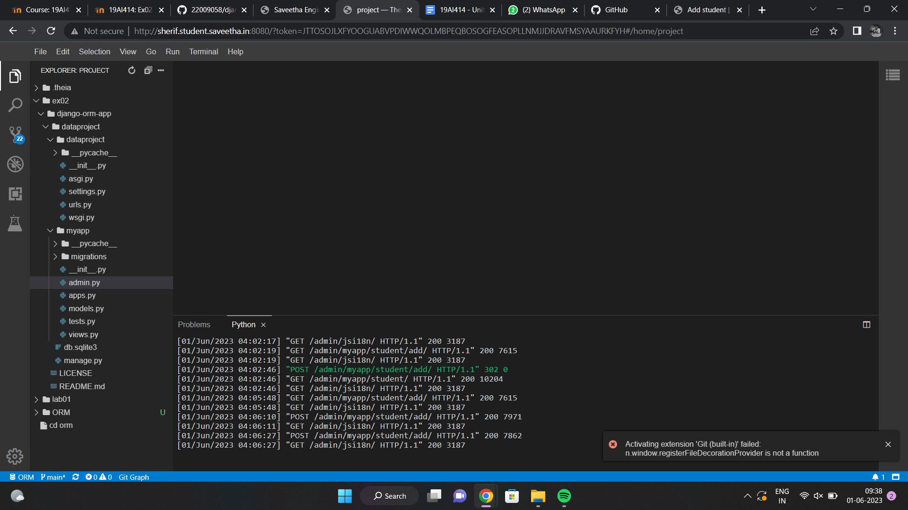

# Django ORM Web Application

## AIM
To develop a Django application to store and retrieve data from a database using Object Relational Mapping(ORM).

## Entity Relationship Diagram

Include your ER diagram here

## DESIGN STEPS

### STEP 1:

### STEP 2:

### STEP 3:

Write your own steps

## PROGRAM

```py
from django.db import models
from django.contrib import admin

# Create your models here.
class Student(models.Model):
    referencenumber=models.CharField(primary_key=True,max_length=20,help_text='Employee ID')
    name=models.CharField(max_length=100)
    age=models.IntegerField()
    email=models.EmailField()
    contact=models.IntegerField()

class StudentAdmin(admin.ModelAdmin):
    list_display=('referencenumber','name','age','email','contact')    
```
```py
from django.contrib import admin
from .models import Student,StudentAdmin

admin.site.register(Student,StudentAdmin)
```    

## OUTPUT


### serveroutput



### clientoutput


## RESULT
